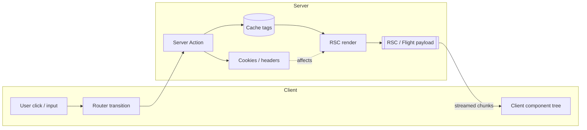
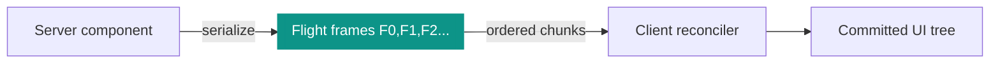
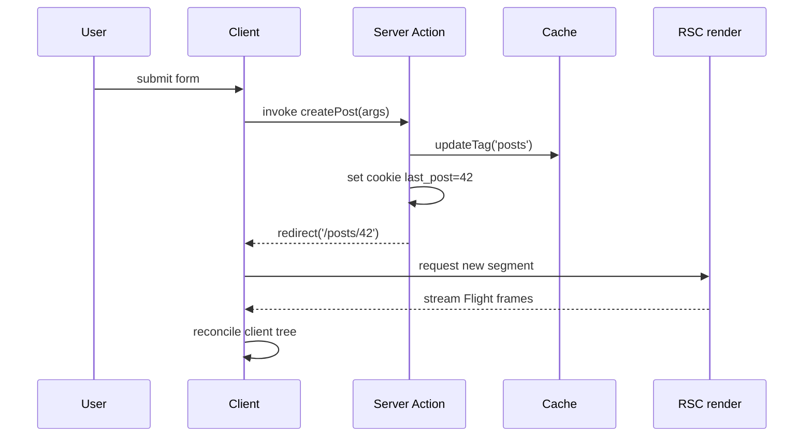
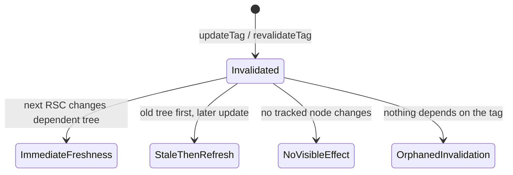
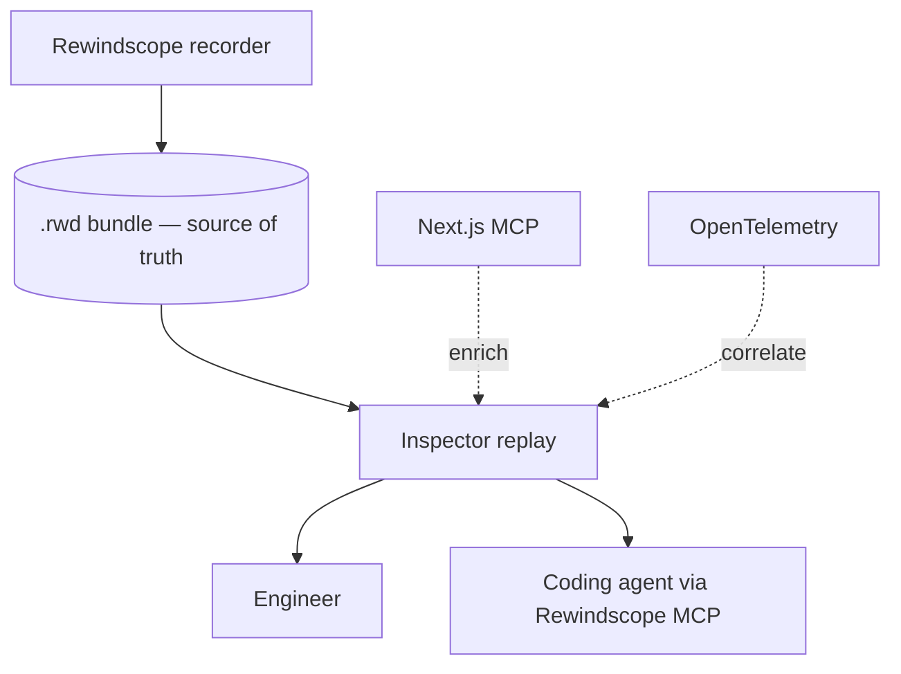
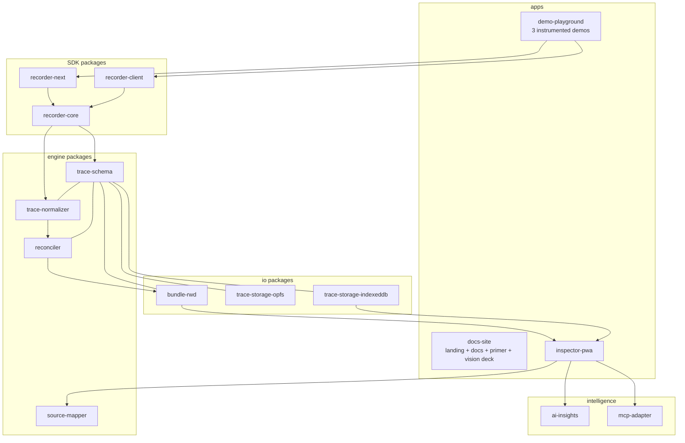
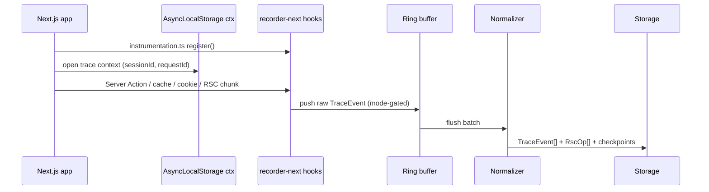
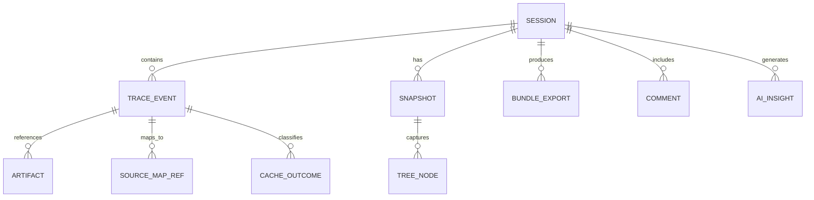
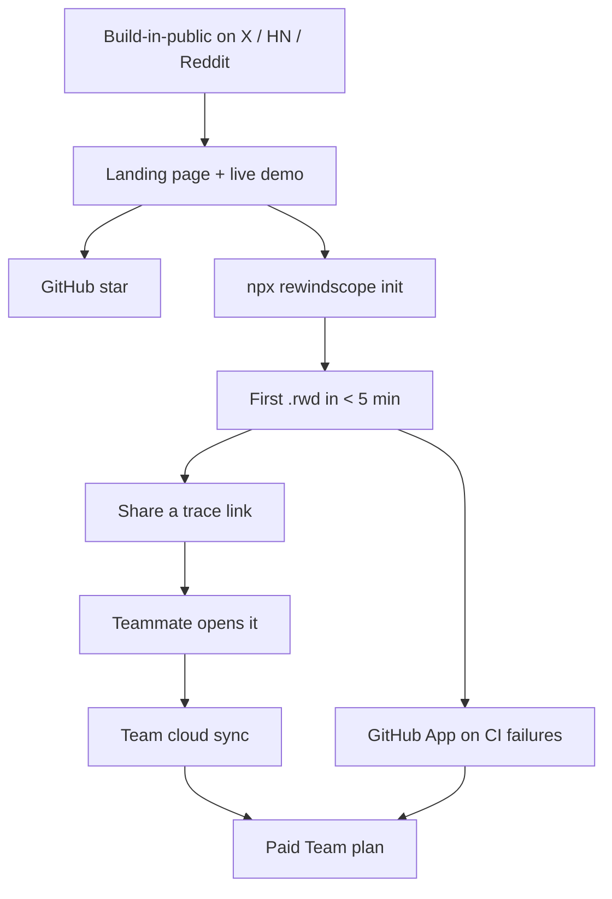

# Rewindscope — Master Blueprint

> The single source of truth for **what** Rewindscope is, **how** it works end-to-end, and the
> **phased plan** to build it to a fundable, scalable, open-source product. Diagrams are Mermaid
> (render on GitHub and in the docs site). Pair with [ROADMAP.md](./ROADMAP.md),
> [DESIGN.md](./DESIGN.md), and [BUILD_IN_PUBLIC.md](./BUILD_IN_PUBLIC.md).

---

## Part 1 — Concepts, explained visually

Every concept a first-time reader needs, as a diagram. These power the docs site's "Primer" section.

### 1.1 The App Router execution split
The core reason debugging is hard: one interaction crosses two runtimes and arrives over time.



### 1.2 React Server Components & the Flight payload
RSC output is a *serialized protocol* (often called "Flight"), not HTML. Treat it as structured
data to parse/normalize/snapshot — never `eval`.



### 1.3 Server Actions lifecycle
A single action can fan out into cache writes, cookies, redirects, and a re-render.



### 1.4 Cache tags & freshness semantics
The hard question isn't "was a tag invalidated" — it's "did the user actually see fresh data."



### 1.5 Where Rewindscope sits (MCP, observability, replay)
MCP and observability are *enrichment*. Rewindscope is the **record + replay** core.



---

## Part 2 — The product pipeline (end-to-end)

```mermaid
flowchart LR
  subgraph Capture
    SR[recorder-next<br/>server instrumentation]
    CR[recorder-client<br/>tree + transitions]
  end
  subgraph Process
    N[trace-normalizer<br/>raw → RscOp[]]
    RECON[reconciler<br/>replay graph + checkpoints]
    REDACT[redaction<br/>PII / secrets]
  end
  subgraph Persist
    IDB[(IndexedDB / OPFS)]
    RWD[(.rwd bundle)]
  end
  subgraph Consume
    INS[Inspector PWA]
    MCPS[Rewindscope MCP server]
    AI[AI insights]
    VS[VS Code ext]
  end
  SR --> REDACT --> N
  CR --> N
  N --> RECON
  RECON --> IDB
  RECON --> RWD
  IDB --> INS
  RWD --> INS
  RWD --> MCPS
  INS --> AI
  INS --> VS
  EM[Next.js MCP] -. enrich .-> INS
```

**One sentence:** capture on both sides → redact → normalize to ops → reconcile into a
versioned replay graph with checkpoints → persist locally / export `.rwd` → replay in the
inspector, queryable by humans, agents, and your editor.

---

## Part 3 — High-Level Design (HLD)



**Boundaries that matter**
- `recorder-core` + `trace-schema` are **framework-agnostic** (enables Remix/SvelteKit later).
- `reconciler` is the **highest-risk** unit and lives alone, test-first.
- `.rwd` is **self-contained**; replay never needs a live server or MCP.

---

## Part 4 — Low-Level Design (LLD)

### 4.1 Core data flow (request scope)


### 4.2 Trace schema (Zod-validated, versioned)
`TraceEvent` (11 phases), `RscFrame` + `RscOp`, `CacheOutcome`, `Session`, `Snapshot`,
`SourceMapRef`. Every bundle carries `schemaVersion`; `bundle-rwd` migrates older bundles.

### 4.3 Reconciliation algorithm (the replay engine)
```
for each session:
  group frames by request/action lineage
  sort by (ts, frameIndex)
  init empty replay tree
  for each frame:
    for each normalized op: apply(op, tree)   # create/replace/patch/suspend/resolve/remove
    if stableBoundary(frame):                 # request done | redirect | suspense resolve
      persist checkpoint snapshot              #             | action end | new route segment
      emit tree:diff event
  store structural diffs between checkpoints   # keeps .rwd small, scrubbing O(1) to a checkpoint
```

### 4.4 Entity model (ER)


---

## Part 5 — Roadmap with per-module build-in-public

Each **module** ships with a post. Format per module: **Hook · Problem · What shipped · Demo
artifact · Visual**. (Full drafts in [BUILD_IN_PUBLIC.md](./BUILD_IN_PUBLIC.md); this is the map.)

### Phase 0 — Foundations
| Module | Build-in-public angle | Demo artifact |
|---|---|---|
| Monorepo + CI skeleton | "Day 1: the skeleton. pnpm + Turbo + 8-stage CI before a line of product." | CI graph screenshot |
| `trace-schema` (Zod) | "One type unifies 11 event phases. The whole product hangs off this." | annotated schema |
| Synthetic fixtures | "Fake data, real UX. The demo runs with zero backend." | scrub clip |
| Redaction layer | "A debugger that leaks secrets is a liability. Redact-by-default." | before/after cookie redaction |

### Phase 1 — Landing + interactive demo  ✅ (in progress)
| Module | Angle | Artifact |
|---|---|---|
| LP + swimlane demo | LAUNCH: "App Router needs its Redux DevTools moment." | hero scrub clip |
| Theme + design language | "An oscilloscope for your server render." | light/dark toggle gif |
| Benchmarks teaser | "Dev-only overhead, measured against OTel." | metrics bar gif |

### Phase 2 — Inspector MVP
| Module | Angle | Artifact |
|---|---|---|
| `.rwd` load/render | "Export a session, open it anywhere — drag & drop." | drag-drop clip |
| Virtualized timeline | "10k events, still 60fps." | perf clip |
| 5 inspector modes | THREAD: "5 ways to look at one session." | mode-switch clip |
| Export/import round-trip | "Bit-for-bit lossless bundles." | diff screenshot |

### Phase 3 — Recorder MVP (the flex)
| Module | Angle | Artifact |
|---|---|---|
| `instrumentation.ts` hook | "It's real — recording an actual Next.js session." | terminal + inspector |
| Server Action capture | "Every action, args, outcome, source." | action pane clip |
| Cache/cookie/redirect capture | "The whole response-mutation trail." | state-strip clip |
| `recorder-client` tree diff | "Watch the client tree reconcile, node by node." | tree-diff clip |
| `reconciler` checkpoints | THREAD: "Replaying React without a shadow runtime." | algorithm diagram |

### Phase 4 — Demo quality + intelligence
| Module | Angle | Artifact |
|---|---|---|
| Cache Semantics classifier | "Not 'tag invalidated' — did the user see fresh data?" | orphaned-invalidation catch |
| Payload explorer | "Flight frames, parsed and safe." | payload clip |
| `source-mapper` | "Click a tick → your code." | jump-to-source clip |
| Benchmark harness | "Numbers + methodology, OTel-style." | benchmark report |

### Phase 5 — Distribution
| Module | Angle | Artifact |
|---|---|---|
| VS Code extension | "Debug the session from your editor." | ext clip |
| `mcp-adapter` enrichment | "actionId → file:symbol via Next.js MCP." | side-panel clip |
| Rewindscope MCP server | "Ask your agent: which action caused this stale state?" | agent Q&A clip |
| `ai-insights` | "One click → a bug report a teammate can act on." | generated report |

### Phase 6 — Growth / scale
Cloud sync alpha · shareable links · browser extension · desktop (Tauri) · Remix/SvelteKit adapters.

---

## Part 6 — What to add to be a fundable, scalable startup (YC-grade)

Beyond the product, these make it shippable, scalable, and VC-credible.

### Engineering & scale
- **Versioned, migratable trace schema** + compatibility tests across Next.js patch versions (framework internals drift).
- **Capture modes + prod no-op** so the SDK is safe to ship; tree-shakeable; zero prod cost.
- **Redaction/PII pipeline** with config + tests — table stakes for sharing traces and for enterprise.
- **Deterministic replay** (seed `Date.now`/`random` boundaries) so repros are reproducible.
- **Performance budgets in CI** (capture overhead thresholds) + golden-trace + visual-regression gates.
- **Self-hostable** cloud sync (privacy-first); BYO storage (S3/R2) for teams.

### Product & DX
- **One-command install** (`npx rewindscope init`) wiring `instrumentation.ts`.
- **Framework-agnostic core** to expand TAM (Remix, SvelteKit, TanStack Start) without rewrites.
- **GitHub App**: auto-capture a `.rwd` on E2E/CI failure, attach to the PR/issue → regression-repro tool.
- **Shareable read-only trace links** (Sentry-replay style) — viral loop + the paid hook.
- **OpenTelemetry interop** (ingest spans as a lane, export ticks) — fits existing stacks.

### Business & GTM (open-core)
- **License**: MIT core (SDK + inspector + schema) for adoption; **commercial** cloud (team sync, retention, SSO, audit, shared links, AI quota).
- **Pricing sketch**: Free (local, solo) · Team (cloud sync, shared links, retention) · Enterprise (SSO/SAML, self-host, support, SLA).
- **Wedge → expand**: solo dev debugging → team regression repros → CI-integrated quality gate.
- **Metrics that matter to VCs**: GitHub stars/contributors, weekly active inspectors, `.rwd` exports, traces shared, time-to-first-trace, paid team conversion, logo land (which Next.js shops adopt).
- **Compliance roadmap** (post-PMF): SOC 2 Type II, data residency, DPA — gate enterprise.
- **Moat**: the trace format + the reconciliation/semantics engine + ecosystem (MCP, editor, CI) — not the UI.

### Trust & community
- `CONTRIBUTING`, `CODE_OF_CONDUCT`, issue/PR templates, `good-first-issue` backlog, public roadmap, Discord.
- Security policy + responsible disclosure (Flight payloads have had CVEs — show you take it seriously).
- Telemetry **opt-in only**, documented; privacy page.

---

## Part 7 — Acquisition funnel



Each stage has one metric (Part 6). The viral edge is **shared trace links** pulling teammates in.

---

## Part 8 — Docs site & VC/founder deck (planned build)

Two surfaces, both in `apps/docs-site`:

**A. Documentation website** (Nextra/Fumadocs, `/docs`)
- Primer (the Part 1 diagrams, interactive).
- HLD / LLD / ER / pipeline (Part 2–4), Mermaid-rendered with prose.
- Recorder setup, capture modes, `.rwd` format spec, schema reference.
- MCP server reference, VS Code guide, benchmarking methodology.
- Contributing + architecture decision records (ADRs).

**B. Vision deck** (`/vision`, also exportable to PDF via Slidev or print CSS)
- For VCs/founders: problem → why now → demo → market gap → wedge → six planes → architecture →
  traction (stars/usage) → roadmap → business model → ask.
- Visual, scroll-driven, reuses the live demo and diagrams; "Download PDF" for offline sharing.

> Build order: docs site scaffolds in Phase 2 (alongside inspector), vision deck refreshed each
> phase as traction grows. Both deploy with the landing page.
